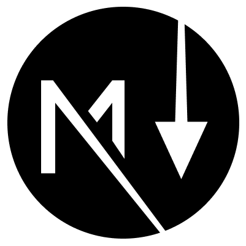

<p align="center">
   <br/>
   
   <h3 align="center">next-markdown</h3>
   <p align="center">Markdown Pages for Next.js</p>
   <p align="center">
   Dynamic Routes • Blog Aware • Design Your Layout
   </p>
   <p align="center" style="align: center;">
      <a href="https://www.npmjs.com/package/next-markdown">
        
      </a>
      <a href="https://www.npmtrends.com/next-markdown">
        
      </a>
      <a href="https://github.com/frouo/next-markdown/stargazers">
        
      </a>
   </p>
   <p align="center" style="align: center;">
      <a href="https://twitter.com/nextmarkdown">
        
      </a>
   </p>
</p>

Made for people

- having a [nextjs](https://nextjs.org/) project
- in ❤️ with markdown
- who want to generate boring (but very necessary!) pages like `/about`, `/terms`, `/blog`, `/docs` or `/whatever/other/route` from markdown files with 0 effort

Used by

- **lembot.com** - all pages except the home page are generated from markdown hosted in a separate public [github repo](https://github.com/frouo/lembot-public-website).
- **[snappify.io](https://snappify.io)** (blog, docs) - a powerful design tool to create and manage beautiful images of your code.
- **[frouo.com](https://frouo.com)** - a dev blog
- create a PR to add your website, or use [twitter DM](https://twitter.com/nextmarkdown)

## Get Started ✨

In your nextjs project, run

```bash
npm install next-markdown
```

Add the following `[...nextmd].jsx` file in the `pages/` folder

```nodejs
import NextMarkdown from "next-markdown";

const nextmd = NextMarkdown({ pathToContent: "./pages-markdown" });

export const getStaticPaths = nextmd.getStaticPaths;
export const getStaticProps = nextmd.getStaticProps;

export default function MarkdownPage({ frontMatter, html, subPaths }) {
  return <div dangerouslySetInnerHTML={{ __html: html }} /> 👈 design your own layout 🧑‍🎨
}
```

## Usage 👋

At the root of your project create the folder `pages-markdown/`, add the following `hello.md` file

```
# Hello World

This is **awesome**
```

That's it. Open `http://localhost:3000/hello` page and see the magic.

Enjoy.


## Features 🚀

### Dynamic Routes for Markdown Files

`next-markdown` generates routes based on the path of your markdown files.

Just like nextjs does with `pages/`.

For example, the following project structure will result into creating the following pages:

```
pages/
├ index.jsx    ......... ➡️ /
├ caveat.jsx   ......... ➡️ /caveat
├ [...nextmd].jsx

pages-markdown/
├ about.md     ......... ➡️ /about
├ caveat.md    ......... ➡️ ❌ because `pages/caveat.jsx` is already defined cf. https://nextjs.org/docs/routing/dynamic-routes#caveats
├ hello/
  ├ index.md   ......... ➡️ /hello
  ├ world.md   ......... ➡️ /hello/world
  ├ jurassic/
    ├ park.md  ......... ➡️ /hello/jurassic/park
├ blog/
  ├ index.md   ......... ➡️ /blog
  ├ hello.md   ......... ➡️ /blog/hello
  ├ world.md   ......... ➡️ /blog/world
├ docs/
  ├ index.md   ......... ➡️ /docs
  ├ get-started.md   ... ➡️ /docs/get-started
  ├ features.md   ...... ➡️ /docs/features
  ├ contribute.md   .... ➡️ /docs/contribute
```

See the [example](./examples/dynamic-routes/).

### Blog Aware ([example](./examples/blogging/))

`next-markdown` is blog-aware:

- list all the posts
- write draft or unpublish a post by simply prefixing the file name with an underscore (eg. `_hello.md` will redirect to 404)
- reading time
- etc.

### Documentation ([example](./examples/documentation/))

`next-markdown` lets you build a documentation:

- sidebar
- previous / next
- organize your docs by folders
- etc.

### Table of Contents ([example](./examples/blogging/))

For each page you'll receive the Table of Contents based on headings in your markdown.

### MDX Support ([example](./examples/mdx/))

There is nothing to setup on your side, MDX support comes for free.

You can mix `.md` and `.mdx` files.

### Configure custom remark and rehype plugins ([example](./examples/custom-remark-rehype-plugins/))

`next-markdown` comes with some default remark and rehype plugins to ensure its basic functionality.

In some cases you might want to specify additional plugins to enrich your page with extra features.

You can pass custom remark and rehype plugins via the `next-markdown` initializer config:

```nodejs
import NextMarkdown from "next-markdown";

const nextmd = NextMarkdown({
  ...,
  remarkPlugins: [],
  rehypePlugins: [],
});
```

### Host Your .md Files in Another Repo ([example](./examples/remote-content/))

For many good reasons you may want to host your content in another GIT repo.

## Examples 🖥

Feel free to browse the [examples](./examples) to see `next-markdown` in action.

## Contributing 🏗️

> Thanks for your interest in next-markdown! You are very welcome to contribute. If you are proposing a new feature, please [open an issue](https://github.com/frouo/next-markdown/issues/new) to make sure it is inline with the project goals.

#### 1. Fork this repository to your own GitHub account and clone it to your local device

```bash
git clone https://github.com/your-name/next-markdown.git
cd next-markdown
```

#### 2. Install the dependencies and run dev script

```bash
npm install
npm run dev
```


#### 3. Open **another terminal**, pick an example in the `examples/` folder, install dependencies and run dev

```bash
cd examples/blogging # or dynamic-routes, or remote-content
npm install
npm run dev
```


#### 4. Start coding

- edit files in `src/`, save: http://localhost:3000 gets updated automatically (aka **hot-reloading**)
- add tests in `src/__tests__/`. Run tests with `npm test` command.


#### 5. Submitting a PR

Before you make your pull request, make sure to run:

- `npm test` to make sure nothing is broken
- `npm run format` to make sure the code looks consistent
- `npm run lint` to make sure there is no problem in the code

## Contributors 🙏

<a href="https://github.com/frouo/next-markdown/graphs/contributors">
  
</a>
